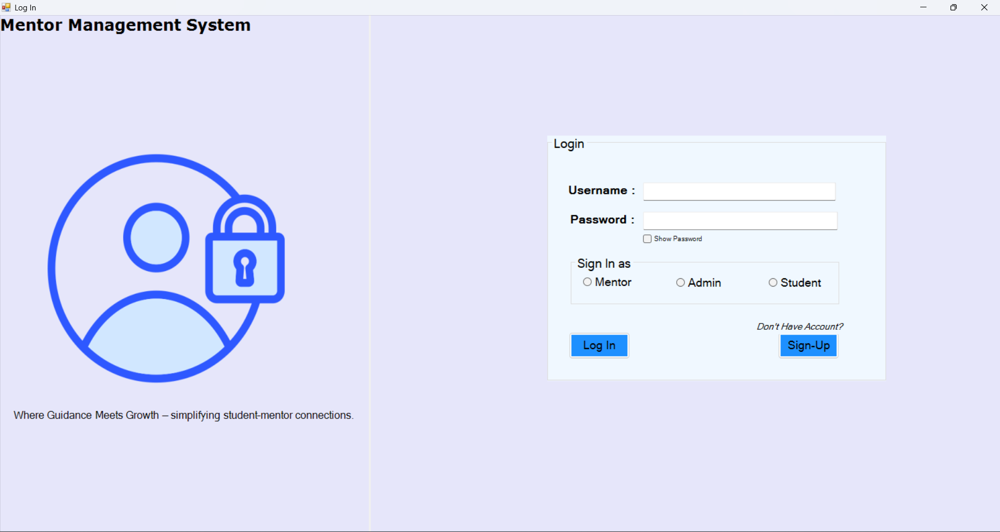
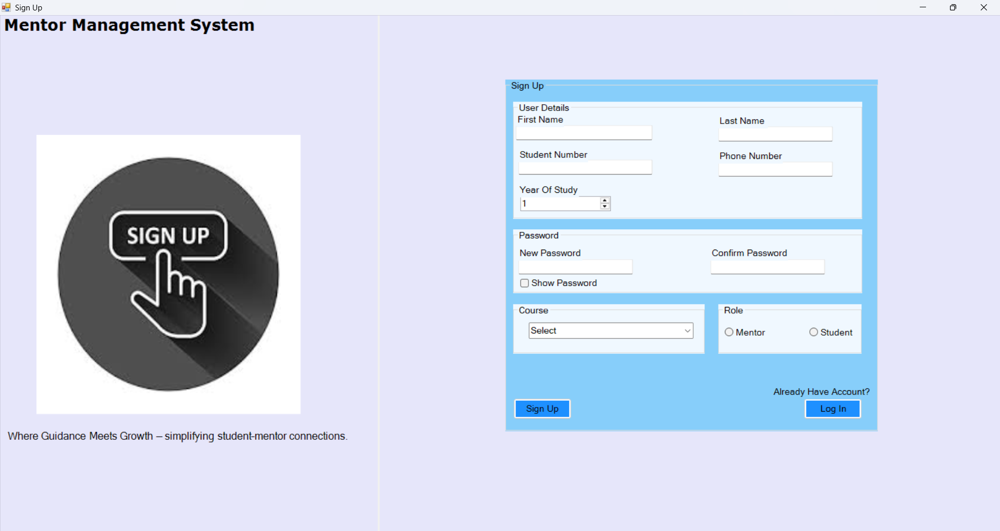
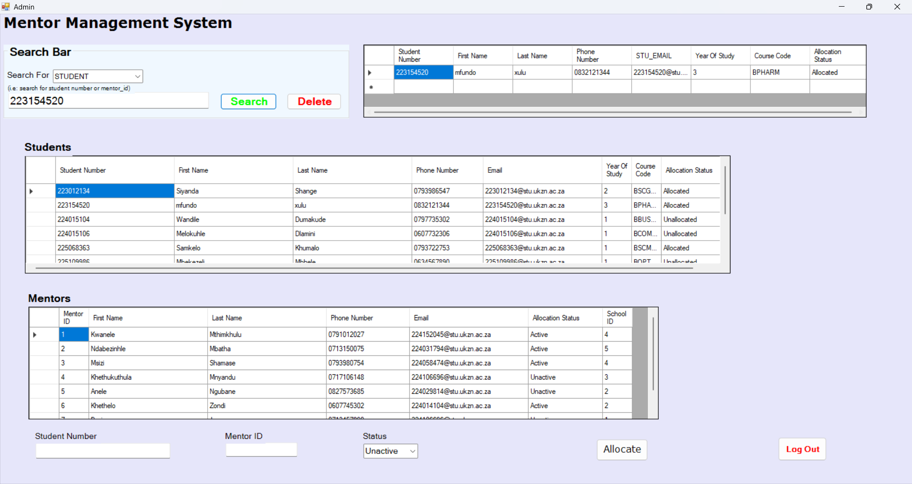
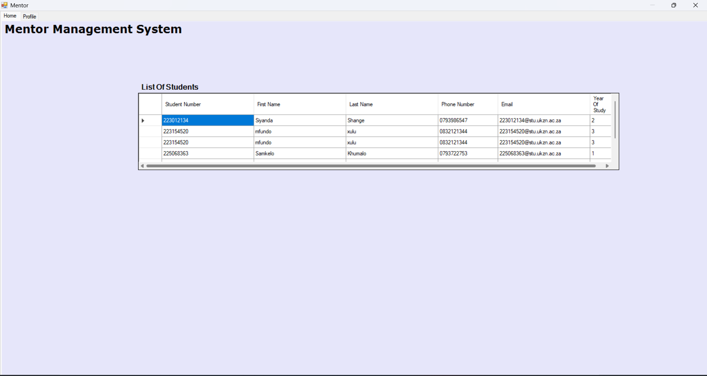
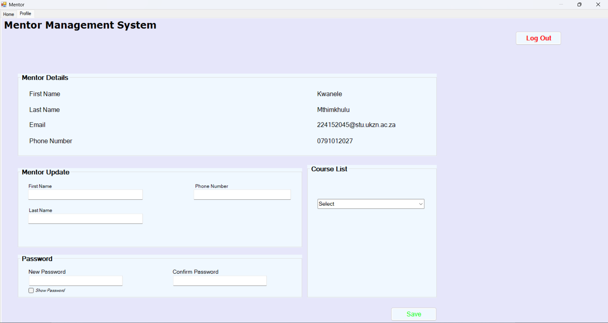
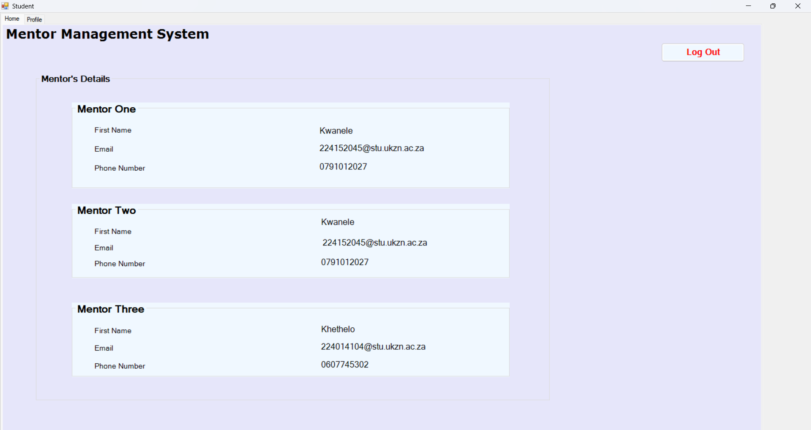
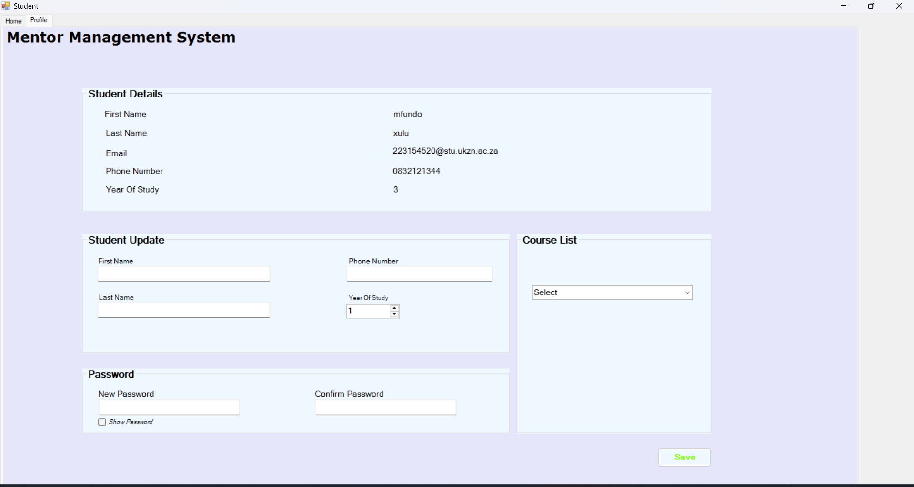

# Mentor Management System

A **C# Windows Forms** desktop application built for managing student-mentor allocations at a university. Developed as an academic project at the **University of KwaZulu-Natal (UKZN)**.

---

## 📋 Overview

The Mentor Management System streamlines the process of connecting students with mentors. It supports three user roles — **Admin**, **Mentor**, and **Student** — each with their own dashboard and functionality.

> *"Where Guidance Meets Growth – simplifying student-mentor connections."*

---

## ✨ Features

### 🔐 Login & Sign Up
- Secure login system with role selection (Admin, Mentor, Student)
- Show/hide password toggle
- Sign Up form for new users with course and role selection

### 🛠️ Admin Panel
- View all **Students** and **Mentors** in data tables
- **Search** for students or mentors by ID
- **Allocate** students to mentors with status tracking (Active/Unactive)
- **Delete** records
- Full control over allocation management

### 👨‍🏫 Mentor Dashboard
- View a **list of allocated students** with their details
- **Profile page** to update personal info (name, phone number)
- Change password and update course
- Log Out

### 🎓 Student Dashboard
- View assigned **Mentor's Details** (up to 3 mentors shown)
- **Profile page** to update personal details
- Change password and update course
- Log Out

---

## 🖥️ Screenshots

### Login Page


### Sign Up


### Admin Panel


### Mentor Dashboard


### Mentor Profile


### Student Dashboard


### Student Profile


### Database ERD
.jpg)

---

## 🛠️ Tech Stack

| Technology | Details |
|---|---|
| Language | C# |
| Framework | .NET Framework 4.7.2 |
| UI | Windows Forms (WinForms) |
| IDE | Visual Studio 2022 |
| Database | Local XML Dataset (.xsd) |

---

## 📁 Project Structure

```
MentorManagementSystem/
├── LoginForm.cs / .Designer.cs        # Login screen
├── SignUpForm.cs / .Designer.cs       # Registration screen
├── Admin.cs / .Designer.cs            # Admin dashboard
├── Mentor.cs / .Designer.cs           # Mentor dashboard
├── Student.cs / .Designer.cs          # Student dashboard
├── MentorManagementDataSet.xsd        # Database schema
├── images/                            # App screenshots & assets
│   ├── Login_Page.png
│   ├── Sign_up.png
│   ├── Admin_Page.png
│   ├── Mentor_home.png
│   ├── mentor_profile.png
│   ├── student_home.png
│   ├── Student_profile.png
│   └── Mentor_Management_System(ERD).jpg
├── App.config                         # App configuration
└── MentorManagementSystem.csproj      # Project file
```

---

## 🚀 Getting Started

### Prerequisites
- Windows OS
- [Visual Studio 2019 or later](https://visualstudio.microsoft.com/) with **.NET desktop development** workload
- .NET Framework 4.7.2 or higher

### Running the Project

1. **Clone the repository**
   ```bash
   git clone https://github.com/Ndabezinhle-Mbatha/MentorManagementSystem.git
   ```

2. **Open in Visual Studio**
   - Open `MentorManagementSystem.sln`

3. **Build & Run**
   - Press `F5` or click **Start**

---

## 👤 Author

**Ndabezinhle Mbatha**
University of KwaZulu-Natal

---

## 📄 License

This project is open source and available under the [MIT License](LICENSE).
